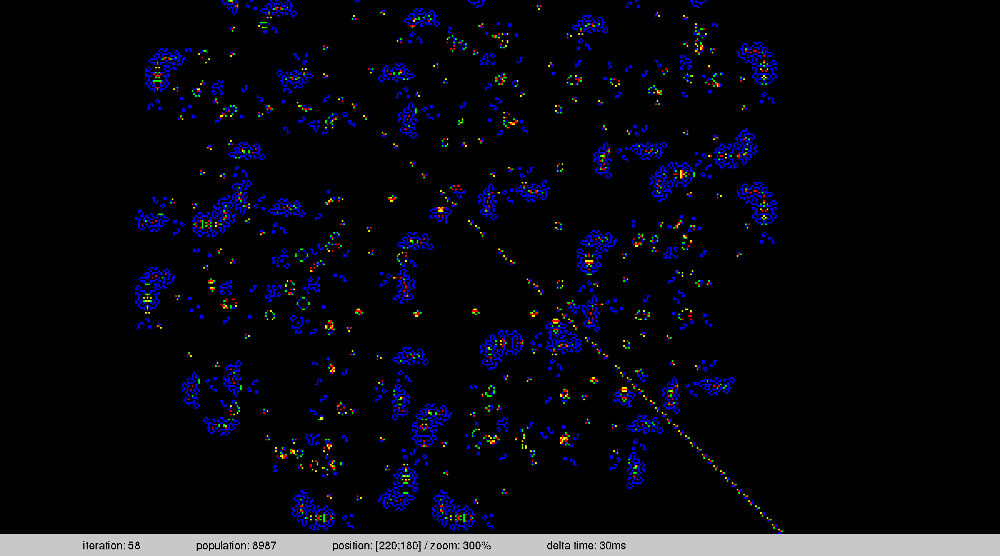

Life
====

A game of life with SDL

https://en.wikipedia.org/wiki/Conway%27s_Game_of_Life

Somes features :
..* zoom, camera moving
..* significant cells colorization
..* maps are loaded from images (see in maps/ for example)
..* ascii mode
..* fullscreen
..* circular and closed maps
..* clocks modifiable
..* possibility to change the rules of the automaton
..* statistics bar

Compilation
-----------
~~~bash
$ make

~~~

Usage
-----
~~~bash
$ ./life [ options ] map_file
~~~

Options:
..* -x map_width    (default: same as map file)
..* -y map_height   (default: same as map file)
..* -t delay        set the delay (in ms) bewteen each generation (def:30)
..* -m              switch to closed map mode (problem with camera movements)
..* -r a[|b]        change the rules. a is a list of number of neighbor
                    for birth, b is like a but for survival.
                    (exemple : -r 3/23 for the official rules)     
..* -f              display in full screen
..* -c              swith to ascii mode

Exemples:
~~~bash
$ ./life maps/double_breeder.png 
~~~

Key Control
-----------
> R -> run

> P -> pause

> S -> stop

> A -> zoom+

> Z -> zoom-

> arrows -> move camera

> space -> reset the camera position

> C -> faster

> V -> slower

